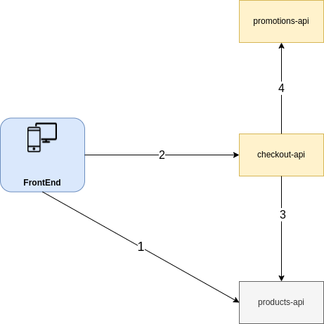

# Checkout System

The idea here is to provide a complete backend for a checkout system. The **products-api** is just a mock.



The steps could read as:
1. The frontend calls products-api, and renders the content to the user;
2. After choosing the products, user procceeds on checking out, and the frontend sends the products list to **checkout-api**;
3. **checkout-api** requests products data to **products-api**;
4. **checkout-api** requests promotions data to **promotions-api**, then calculates the basket's total value and finaly answers it to the frontend;

## Breaking up the directories

The project is organized in directories that isolate the three applications, and a few other goodies at the root. Let's have a look:
* **checkout-api**: Project for the app that will actually do the maths and processing;
* **promotions-api**: Project for the app that manages promotions;
* **products-api**: Inside of this directory there is just the mocked API, plus one script used to start the WireMock Server inside a container;
* **docs**: This directory concentrates both the docs, the answers to the Follow-Up Questions and a collection of requests, that can be imported to Postman in order to consume the apps;

## Running the app
### What do I need to install?

Basically just `docker` and `docker-compose`, in order run everything at once. But, if you want to startup each app individually, then you must install:
* Java (17);
* MongoDB (or you can run it as a Docker container);

### How do I run it?

If you want to run everything at once, as said before, go to the project's root directory and run: 

```
$ docker-compose up
```

Now, to run each app individually, check out the README file for each of them.

### How do I use it?

There's a Postman collection under **docs/requests** directory. There's no promotions created by default, so you probably want to start by creating some of them, before proceeding to test the checkout.

## Running the tests

It's the default for gradlew with spring applications, go to the desired app's root directory and run `./gradlew test`, or run them with the IDE of your choice.
